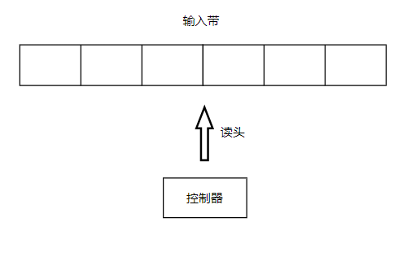
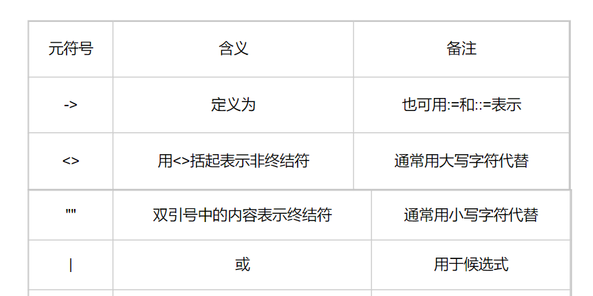
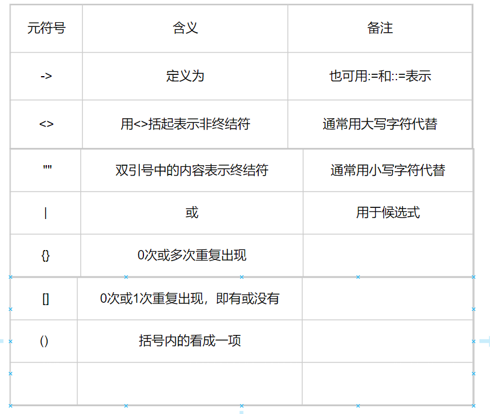

## 有穷自动机
有穷自动机又称为又穷状态自动机，是一种数学模型，也可称为有限状态自动机，这种模型对应的系统具有有限个数的内部状态，系统只需要根据当前所处的状态和面临的输入就能够决定系统的后继行为。当系统处理了输入后，状态也会发生改变。

其由三个部分组成：有穷长度的输入带，一个读头，一个控制器。

## 文法
文法是由一个四元组表示的。它本身是用字母G表示，文法内容用一个四元组表示，包括非终结符Vn，终结符Vt，产生式P，开始符号S，即G=(Vn, Vt, P, S)。

## BNF，EBNF
BNF，即巴科斯范式，是一种程序设计语言描述工具，用来描述给定语言的语法，即描述语言的语言，故可以称为元语言。

EBNF，即扩展BNF

## 词法分析器输入lex，输出token
词法分析器的功能是将源码中的单词封装为token，单词称之为lex（lexeme），其泛指文法中所能推导出的一切终结符。token则为一复合结构，用于存储单词的相关信息。

## 抽象语法树
抽象语法树简称AST，是对源代码的语法结构的抽象。其为源码的精髓。

## unicode和UTF-8
unicode（Universal Multiple-Octet Coded Character Set），俗称unicode，简称UCS，即通用字符集。UTF（UCS Transfer Format），其中UTF-8是unicode的具体实现。

UTF-8编码规则：
- 对于单字节的符号，字节的第一位设为0，后面7位为这个字符的unicode码。
- 对于n字节符号，第一个字节的前n位都设为1，第n+1位设为0，后面字节的前两位均为10，剩下的没有提及的二进制位则为这个字符的unicode码。

## 虚拟机
本系统采用的虚拟机是基于栈的虚拟机。基于栈的虚拟机开发简单，但是效率不如基于寄存器的虚拟机。因此我们采用减少操作码数量的方式提升效率。

减少操作码：取指，译码，执行，前两个操作最为耗时，减少操作码即减少了花费在取指和译码上的时间，因此提升了效率。另外，减少操作码还大大的提高了程序的局部性，使得CPU对下一个指令可预测，也会大大提升速度，虽说总会出现预测失败从而清空流水线（流水线上进行取指，译码，执行）导致速度降低，但是这种方式带来的好处远比代价要多。

## 语法分析器
语法分析器就是把token转换成语法树。

## TDOP(TopDownOperatorPrecedence) - 自上而下算符优先
- rbp: right bind power
- lbp: left bind power
- nud: null denotation  不吸引左边的操作数
- led: left denotation  吸引左边的操作数

用nud方法的符号：因为常量等非操作符是不关心操作数的，也就不关心左边的操作数，因此变量、字面量等和前置运算符用nud方法。

用led方法的符号：中置运算符和后置运算符都关心左边的操作数，因此用led方法。

expression函数是TDOP的核心，它的参数是一个右绑定权值。原理是从左到右分析表达式，并以运算符为中心的左右操作数的两两处理，判断夹在两个运算符之间的操作数属于哪个运算符。

可参考文献：[Top Down Operator Precedence](https://crockford.com/javascript/tdop/tdop.html)
[Top Down Operator Precedence](https://crockford.com/javascript/tdop/index.html)
