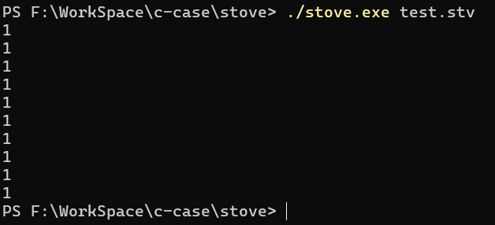
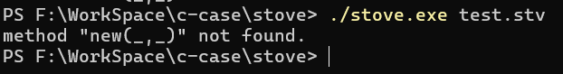

# 🚀 The Stove programming language

The Stove programming language is an object-oriented, interpreted language.

## 🛠️ Build Instructions
On windows, download the source code and go to the source code folder:
```bash
make
```
now you will get a file called stove.exe, then:
```bash
.\stove.exe test.stv
```
if you can look a string on console, the string is "this is a test code for Stove.", so that's ok now.

## 💻 Using Stove
1. It's if-else statement
```stove
if (condition) {
    statement
} else {
    statement
}
```

2. It's for loop statement, the `1..10` is a range(like python's range() object) object.

```stove
for i (1..10) {
    System.print(i) 
}
```

3. It's while loop statement, you should know that you can's use `++` to self-add.

```stove
var num = 0
while (num < 10) {
    System.print(num)
    num = num + 1
}
```

4. You can's use `define` keywords to define a method and a maximum of 16 argument are supported.

```stove
define test_fun(arg) {
    System.print(arg)
    return "stove"
}

var ans = test_fun("hello world")
System.print(ans)
```

5. You can define a list object literally, or you can define it using the underlying method.

```stove
var a = []
var b = List.new()
```

It's List class's method and args:

```
var a = []
var arg = a.append(arg)                 //add a element and return this arg
a.clear()                               //clear list
var count = a.count                     //return length of list
var element = a.insert(index, element)  //insert the element at the index and return this element
var element = a.removeAt(index)         //remove index element and return this element
var element = a[index]                  //return index element
a[index] = element                      //like insert() method
```

6. You can define a map object in the form of literals or underlying method.
```stove
var a = {"key": "value"}
var b = Map.new()
```

It's Map class's method and args:
```stove
var a = {}
a.clear()                      //clear map
var bool = a.containsKey(key)  //check whether a key exists in the map object and return bool
var count = a.count            //return the number of key-value pairs in a map object
var value = a.remove(key)      //remove key's value and return this value
var value = a[key]             //you can refer to the index value of the Python dictionary
a[key] = value                 //add a key-value pair
```

7. You can define a range object in the following way:
```stove
var range = 1..10
```

It's Range object's method and args:
```stove
var range = 1..10
var from = range.from                         //return range's from
var to = range.to                             //return range's to
var max = range.max                           //return range's max value
var min = range.min                           //return range's min value
var iterate = range.iterate(arg)              //return range's arg element
var iteratorValie = range.iteratorValue(arg)  //return iterator
```

8.  It's Num object's method and args:
```stove
/* It's the four arithmetic and comparison of numbers */
num1 + num2
num1 - num2
num1 * num2
num1 / num2
num1 % num2
num1 > num2
num1 < num2
num1 >= num2
num1 <= num2


/* This is a bit operation of numbers */
num1 & num2
num1 | num2
num1 >> num2
num1 << num2
~num


Num.pi               //3.14159265358979323846
Num.fromString(arg)  //convert string to num
num.abs              //it's abs() method of c lang
num.acos             //it's acos() method of c lang
num.asin             //it's asin() method of c lang
num.atan             //it's atan() method of c lang
num.ceil             //it's ceil() method of c lang
num.sin              //it's sin() method of c lang
num.cos              //it's cos() method of c lang
num.tan              //it's tan() method of c lang
num.floor            //it's floor() method of c lang
num.sqrt             //it's sqrt() method of c lang
num.atan()           //it's atan2() method of c lang
num.fraction         //return the decimal part of this number
num.truncate         //return the integet part of this number
num.isInfinity       //judge if the number is infinite
num.isInteger        //judge if the number is integer
num.isNan            //judge if the number is nan
num.toString         //convert num to string
```

9. It's String object's method and args:
```stove
String.fromCodePoint(arg)  //create string from code point

string.contains(arg)       //check if the string contain arg and return bool
string.startsWith(arg)     //check if the string start with arg and return bool
string.endsWith(arg)       //check if the string end with arg and return bool
string.indexOf(arg)        //check where the substring starts in the string and return this index
string.iterate(arg)        //an iterator that returns the next UTF-8 character, arg must be positive integer
string.iteratorValue(arg)  //return the value corresponding to the iterator
string.toString            //itself
string.count               //return length of string
```

10. It's Thread object's method and args:
```stove
Thread.new(arg)        //create a instance of thread
Thread.abort(error)    //exit the thread with the error message as a argument
Thread.suspend()       //suspend thread
Thread.yield()         //give up the CPU without argument
Thread.yield()         //give up the CPU with argument
Thread.current         //return current thread

thread.call()          //switch to next thread without argument
thread.call(arg)       //switch to next thread with argument
thread.isDone          //return whether the current thread has run completely
```

11. It's System class's method and args:
```stove
System.print(arg)  //output arg
System.print()     //without arg will output "\n"
System.clock       //it's return timestamp
```

## ❓ Existing problems
1. The for loop statement fails to iterate, for example:
```stove
for i (1..10) {
    System.print(i)
}
```
it will output:


2. There is a problem with the way the class is constructed:
```stove
class Test {
    var name
    var age
    new(a, b) {
        name = a
        age = b
    }

    say() {
        System.print("I am" + name + "," + age + "years old.")
    }
}

var t = Test.new("stove", "0")
t.say()
```
it will output an error:


## 🤝 Contribute to the stove
You can create an issue or pull request, if you pull request, you should bring your test code and effects.
