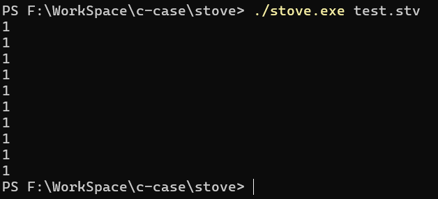

# 🚀 Stove 编程语言

Stove是一门面向对象的解释性语言

## 🛠️ 构建说明
在Windows操作系统上，下载好源代码并打开源代码文件夹，打开终端并执行：
```bash
make
```
执行后你将会得到一个stove.exe文件，然后执行：
```bash
.\stove.exe test.stv
```
如果你能看到一串字符串（字符串内容是“this is a test code for Stove.”）输出在了终端上，那么你成功了。

## 💻 使用Stove
1. if-else语句
```stove
if (condition) {
    statement
} else {
    statement
}
```

2. for循环语句，其中`1..10`是一个range对象，类似Python中的range对象

```stove
for i (1..10) {
    System.print(i) 
}
```

3. while循环语句，Stove不支持`++`运算符实现变量的自增
```stove
var num = 0
while (num < 10) {
    System.print(num)
    num = num + 1
}
```

4. 使用`define`关键字定义一个函数，Stove中函数最多支持16个参数
```stove
define test_fun(arg) {
    System.print(arg)
    return "stove"
}

var ans = test_fun("hello world")
System.print(ans)
```

5. 你可以使用字面量或者底层的类的构造方法定义一个列表
```stove
var a = []
var b = List.new()
```

如下为List对象的方法和参数：

```
var a = []
var arg = a.append(arg)                 //将参数arg添加到列表中
a.clear()                               //清空列表
var count = a.count                     //返回列表长度
var element = a.insert(index, element)  //在index索引处插入元素element
var element = a.removeAt(index)         //删除index处的元素并返回这个元素
var element = a[index]                  //返回index处的元素
a[index] = element                      //修改index处的元素值
```

6. 你可以使用字面量或者底层的类的构造方法定义一个Map对象
```stove
var a = {"key": "value"}
var b = Map.new()
```

如下是Map对象的方法和参数：
```stove
var a = {}
a.clear()                      //清空Map
var bool = a.containsKey(key)  //检查Map中是否存在这个键，返回bool值
var count = a.count            //返回Map中键值对的个数
var value = a.remove(key)      //删除以key为键的键值对
var value = a[key]             //返回Map的以key为键的值
a[key] = value                 //如果已经存在key，则修改value，否则添加键值对
```

7. 你可以使用以下方式定义一个range对象：
```stove
var range = 1..10
```

如下是Range对象的方法和参数
```stove
var range = 1..10
var from = range.from                         //返回from
var to = range.to                             //返回to
var max = range.max                           //返回最大值
var min = range.min                           //返回最小值
var iterate = range.iterate(arg)              //迭代range中的值，并不索引
var iteratorValie = range.iteratorValue(arg)  //range的迭代就是range中从from到to之间的值，因此直接返回迭代器就是range的值
```

8. 如下是数字（Num）类型的方法和参数
```stove
/* 基本的四则运算和其他运算 */
num1 + num2
num1 - num2
num1 * num2
num1 / num2
num1 % num2
num1 > num2
num1 < num2
num1 >= num2
num1 <= num2


/* 位运算 */
num1 & num2
num1 | num2
num1 >> num2
num1 << num2
~num


Num.pi               //3.14159265358979323846
Num.fromString(arg)  //将字符串转换成数字
num.abs              //C语言的abs()函数
num.acos             //C语言的acos()函数
num.asin             //C语言的asin()函数
num.atan             //C语言的atan()函数
num.ceil             //C语言的ceil()函数
num.sin              //C语言的sin()函数
num.cos              //C语言的cos()函数
num.tan              //C语言的tan()函数
num.floor            //C语言的floor()函数
num.sqrt             //C语言的sqrt()函数
num.atan()           //C语言的atan2()函数
num.fraction         //返回小数部分
num.truncate         //返回整数部分
num.isInfinity       //判断num是否是无穷值
num.isInteger        //判断num是否是整型
num.isNan            //判断num是否是nan
num.toString         //将数字转换成字符串
```

9. 字符串（String）对象的方法和参数：
```stove
String.fromCodePoint(arg)  //从码点创建字符串

string.contains(arg)       //检查字符串是否包含子字符串
string.startsWith(arg)     //检查字符串是否已子字符串开头
string.endsWith(arg)       //检查字符串是否已子字符串结尾
string.indexOf(arg)        //返回子字符串在原字符串中开头的索引
string.iterate(arg)        //返回下一个utf-8字符的迭代器，参数必须是整数
string.iteratorValue(arg)  //返回迭代器对于的值
string.toString            //返回字符串本身
string.count               //返回字符串长度
```

10. 线程（Thread）对象的方法和参数
```stove
Thread.new(arg)        //创建一个线程实例
Thread.abort(error)    //以错误信息error为参数退出线程
Thread.suspend()       //挂起线程
Thread.yield()         //无参数让出CPU
Thread.yield(arg)      //有参数让出CPU
Thread.current         //然后当前线程

thread.call()          //无参数切换到下一线程
thread.call(arg)       //有参数切换到下一线程
thread.isDone          //返回当前线程是否已运行完成
```

11. System类的方法和参数：
```stove
System.print(arg)  //输出参数
System.print()     //输出换行符
System.gc()        //垃圾回收会自动运行，但是你也可以手动启动
System.clock       //返回时间戳
```

## ❓ 存在的问题
1. for循环语句迭代错误，如下
```stove
for i (1..10) {
    System.print(i)
}
```
输出如下：


2. 类的构造方法存在问题，无法正常的读入识别构造方法：
```stove
class Test {
    var name
    var age
    new(a, b) {
        name = a
        age = b
    }

    say() {
        System.print("I am" + name + "," + age + "years old.")
    }
}

var t = Test.new("stove", "0")
t.say()
```
输出如下错误：


## 🤝 为Stove做出贡献
你可以提交issue或者发起一个pull request，如果你发起pull request，你需要带上你的测试代码和效果。
