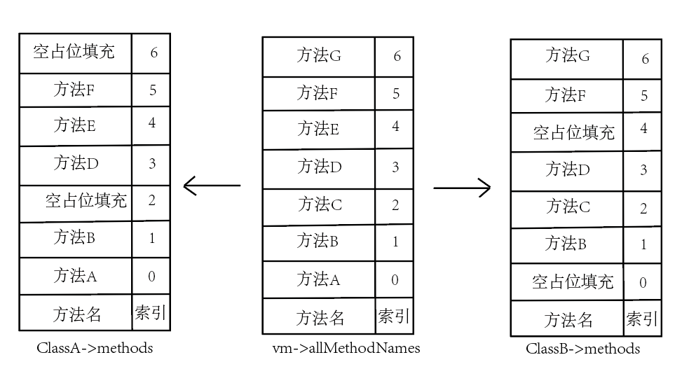

# 符号表

## 模块符号表
在stove系统中，模块定义为ObjModule对象，我们将其存储在vm->allModules中，类型为ObjMap *，其中key为模块名称，value为模块的Value结构。

## 类方法符号表
在本系统中，我们将所有类的方法名存储在vm->allMethodNames中，与类中的class->methods索引相同，有不同类相同方法名的情况则可以与vm->allMethodNames中索引相同，不同方法名则在没有的类中填充空。图解如下：

## 模块变量符号表

## 局部变量符号表
编译单元（见compiler/compiler.c文件）CompileUnit，用其成员localVars表示局部变量的符号表。

## 常量符号表
函数对象（见objectAndClass/include/obj_fun.h文件）中有一个成员constants，类型为ValueBuffer，其即常量表。
