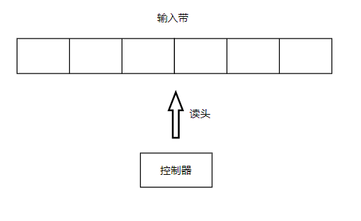
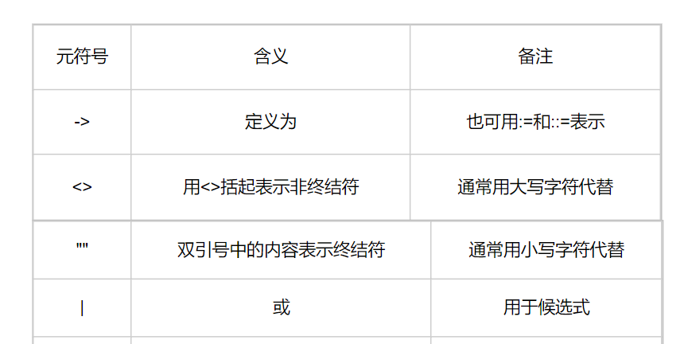
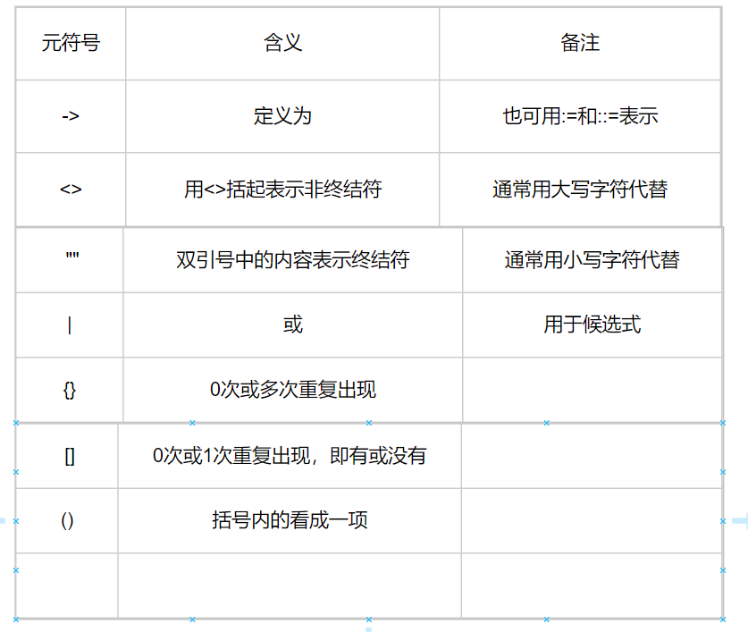

## 有穷自动机
有穷自动机又称为又穷状态自动机，是一种数学模型，也可称为有限状态自动机，这种模型对应的系统具有有限个数的内部状态，系统只需要根据当前所处的状态和面临的输入就能够决定系统的后继行为。当系统处理了输入后，状态也会发生改变。

其由三个部分组成：有穷长度的输入带，一个读头，一个控制器。

## 文法
文法是由一个四元组表示的。它本身是用字母G表示，文法内容用一个四元组表示，包括非终结符Vn，终结符Vt，产生式P，开始符号S，即G=(Vn, Vt, P, S)。

## BNF，EBNF
BNF，即巴科斯范式，是一种程序设计语言描述工具，用来描述给定语言的语法，即描述语言的语言，故可以称为元语言。

EBNF，即扩展BNF

## 词法分析器输入lex，输出token
词法分析器的功能是将源码中的单词封装为token，单词称之为lex（lexeme），其泛指文法中所能推导出的一切终结符。token则为一复合结构，用于存储单词的相关信息。

## 抽象语法树
抽象语法树简称AST，是对源代码的语法结构的抽象。其为源码的精髓。

## unicode和UTF-8
unicode（Universal Multiple-Octet Coded Character Set），俗称unicode，简称UCS，即通用字符集。UTF（UCS Transfer Format），其中UTF-8是unicode的具体实现。

UTF-8编码规则：
- 对于单字节的符号，字节的第一位设为0，后面7位为这个字符的unicode码。
- 对于n字节符号，第一个字节的前n位都设为1，第n+1位设为0，后面字节的前两位均为10，剩下的没有提及的二进制位则为这个字符的unicode码。

